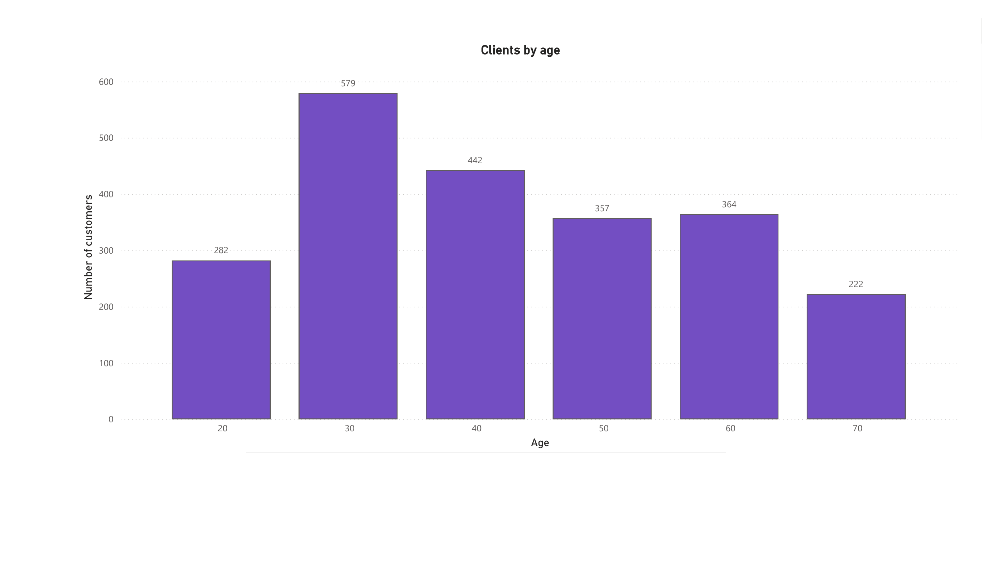

# CAFFEE — Base de Datos Relacional para Cadena de Cafeterías

Diseño e implementación de una base de datos relacional para **CAFFEE**, una cadena de cafeterías con sede en Nueva York en proceso de expansión nacional. El proyecto consolida datos que originalmente viven dispersos en distintos sistemas — software de contabilidad, bases de datos de proveedores, sistemas de punto de venta (POS) y hojas de cálculo — en una única base de datos central que facilita la toma de decisiones basada en datos.

Basado en el proyecto final del curso **IBM: Introducción a Bases de Datos Relacionales**, extendido con un pipeline propio de ETL en Python y visualización en Power BI.

## Escenario

Como Ingeniero de Datos recién contratado por CAFFEE, el objetivo es diseñar el sistema de base de datos relacional que soporte la expansión de la cadena, integrando datos de:

- Información de personal (hoja de cálculo, sede)
- Puntos de venta (hoja de cálculo, sede)
- Ventas (CSV exportado del sistema POS)
- Clientes (CSV exportado del CRM)
- Productos (hoja de cálculo exportada de la base de datos del proveedor)

## Estado del proyecto

### ✅ Completado
- Identificación de entidades y atributos a partir de las fuentes de datos originales
- Diagrama de relación de entidades (ERD) construido con la herramienta ERD de pgAdmin
- Normalización de tablas (2NF)
- Definición de llaves primarias/foráneas y relaciones
- Generación y ejecución del script SQL de creación de objetos de base de datos (PostgreSQL)
- Creación de vistas y vista materializada
- Exportación de datos e importación a MySQL vía phpMyAdmin
- Pipeline ETL en Python (`customer` y `staff`) que extrae desde `public`, transforma (cálculo de edad y antigüedad) y carga hacia el schema `staging`
- Cargas idempotentes con `ON CONFLICT DO UPDATE`, para que el pipeline sea re-ejecutable sin duplicar ni congelar datos calculados
- Manejo seguro de credenciales con `python-dotenv` (`.env` excluido del repositorio vía `.gitignore`)
- Conexión de Power BI Desktop al schema `staging`, con un primer dashboard: personal por sede/puesto y distribución de clientes por edad

## Dashboard (Power BI)




### 🚧 En progreso
- Pipeline ETL para las tablas restantes (`product`, `sales_outlet`, `sales_transaction`, `sales_detail`)
- Ampliación del dashboard de Power BI con métricas de ventas

## Tecnologías

- **PostgreSQL** — diseño y modelado de la base de datos central
- **pgAdmin** — herramienta ERD para modelado visual
- **MySQL / phpMyAdmin** — replicación de datos hacia un segundo RDBMS
- **Python** (`psycopg2`, `python-dotenv`) — pipeline ETL
- **Power BI Desktop** — capa de visualización y análisis

## Estructura

```
/sql
  01_schema.sql              → creación de tablas, llaves primarias y foráneas
  02_views.sql                → vistas
  03_materialized_view.sql    → vista materializada
/erd
  ERD_COFFEE.png               → diagrama de relación de entidades (imagen)
  ERD_COFFEE.pgerd             → proyecto del ERD Tool de pgAdmin (editable)
/etl
  etl_customer.py               → ETL de customer → staging.customer_staging (cálculo de edad)
  etl_staff.py                  → ETL de staff → staging.staff_staging (cálculo de antigüedad)
  .env.example                  → plantilla de variables de entorno (sin credenciales reales)
/dashboard
  staff_by_location.png         → captura del dashboard: personal por sede y puesto
  clients_by_age.png            → captura del dashboard: distribución de clientes por edad
```

> **Nota:** el dataset de prueba (~180,000 registros, generado como parte del curso IBM) se omite de este repositorio por tamaño. La base de datos se puede reconstruir ejecutando `sql/01_schema.sql` y cargando los datos de origen del curso.

## Próximos pasos

1. Replicar el patrón ETL para `product`, `sales_outlet`, `sales_transaction` y `sales_detail`.
2. Ampliar el dashboard de Power BI con métricas de ventas por ubicación y producto.
3. Documentar el flujo completo de datos (arquitectura end-to-end) una vez conectadas todas las tablas.
