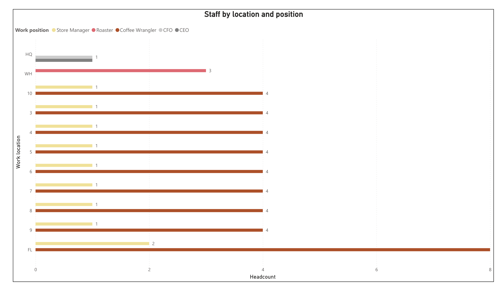
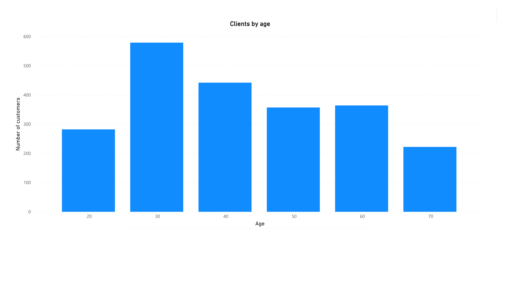
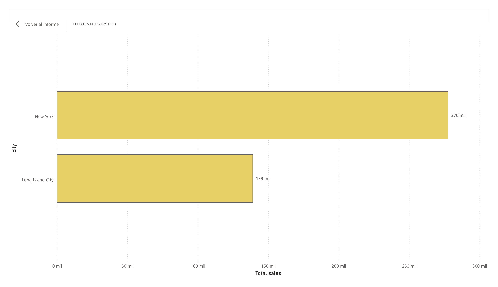

# CAFFEE — Base de Datos Relacional para Cadena de Cafeterías

Diseño e implementación de una base de datos relacional para **CAFFEE**, una cadena de cafeterías con sede en Nueva York en proceso de expansión nacional. El proyecto consolida datos que originalmente viven dispersos en distintos sistemas — software de contabilidad, bases de datos de proveedores, sistemas de punto de venta (POS) y hojas de cálculo — en una única base de datos central que facilita la toma de decisiones basada en datos.

Basado en el proyecto final del curso **IBM: Introducción a Bases de Datos Relacionales**, extendido con un pipeline propio de ETL en Python y un modelo semántico con DAX en Power BI.

## Escenario

Como Ingeniero de Datos recién contratado por CAFFEE, el objetivo es diseñar el sistema de base de datos relacional que soporte la expansión de la cadena, integrando datos de:

- Información de personal (hoja de cálculo, sede)
- Puntos de venta (hoja de cálculo, sede)
- Ventas (CSV exportado del sistema POS)
- Clientes (CSV exportado del CRM)
- Productos (hoja de cálculo exportada de la base de datos del proveedor)

## Estado del proyecto

### ✅ Completado
- Identificación de entidades y atributos a partir de las fuentes de datos originales
- Diagrama de relación de entidades (ERD) construido con la herramienta ERD de pgAdmin
- Normalización de tablas (2NF)
- Definición de llaves primarias/foráneas y relaciones
- Generación y ejecución del script SQL de creación de objetos de base de datos (PostgreSQL)
- Creación de vistas y vista materializada
- Exportación de datos e importación a MySQL vía phpMyAdmin
- Pipeline ETL en Python completo para las 6 tablas del negocio (`customer`, `staff`, `product`, `product_type`, `sales_outlet`, `sales_transaction`, `sales_detail`), extrayendo desde `public` y cargando hacia el schema `staging`
- Estrategia de carga diferenciada por tipo de tabla:
  - **Tablas de dimensión pequeñas** (`customer`, `staff`, `product`, `product_type`, `sales_outlet`): carga completa con `ON CONFLICT DO UPDATE`, refrescando solo los campos que legítimamente pueden cambiar (edad, antigüedad, precio, categoría, teléfono/gerente)
  - **Tablas de hechos grandes e inmutables** (`sales_transaction`, `sales_detail`): carga incremental basada en marca de agua (watermark sobre el ID), evitando reprocesar datos históricos en cada corrida
- Manejo seguro de credenciales con `python-dotenv` (`.env` excluido del repositorio vía `.gitignore`)
- Modelo relacional completo en Power BI Desktop: las 7 tablas de `staging` conectadas mediante relaciones (incluyendo la resolución de un conflicto de rutas ambiguas entre `sales_transaction`, `sales_outlet` y `staff`, dejando la relación redundante `sales_outlet.manager → staff.staff_id` inactiva)
- Medida DAX (`Total sales`) sobre `sales_detail.subtotal`, usada como base de los reportes de ventas
- Dashboard con 5 visualizaciones

## Dashboard (Power BI)








### 🚧 En progreso
- Métricas adicionales (por ejemplo, ventas por empleado o por rango de fecha)
- Documentación de la arquitectura end-to-end del pipeline

## Tecnologías

- **PostgreSQL** — diseño y modelado de la base de datos central
- **pgAdmin** — herramienta ERD para modelado visual
- **MySQL / phpMyAdmin** — replicación de datos hacia un segundo RDBMS
- **Python** (`psycopg2`, `python-dotenv`) — pipeline ETL
- **Power BI Desktop** (modelado de datos, relaciones, DAX) — capa de visualización y análisis

## Estructura

```
/sql
  01_schema.sql              → creación de tablas, llaves primarias y foráneas
  02_views.sql                → vistas
  03_materialized_view.sql    → vista materializada
/erd
  ERD_COFFEE.png               → diagrama de relación de entidades (imagen)
  ERD_COFFEE.pgerd             → proyecto del ERD Tool de pgAdmin (editable)
/etl
  etl_customer.py               → ETL de customer → staging.customer_staging (cálculo de edad)
  etl_staff.py                  → ETL de staff → staging.staff_staging (cálculo de antigüedad)
  etl_product.py                → ETL de product → staging.product_staging
  etl_product_type.py           → ETL de product_type → staging.product_type_staging
  etl_sales_outlet.py           → ETL de sales_outlet → staging.sales_outlet_staging
  etl_sales_transaction.py      → ETL incremental (watermark) de sales_transaction → staging
  etl_sales_detail.py           → ETL incremental (watermark) de sales_detail → staging (cálculo de subtotal)
  .env.example                  → plantilla de variables de entorno (sin credenciales reales)
/dashboard
  staff_by_location.png         → captura del dashboard: personal por sede y puesto
  clients_by_age.png            → captura del dashboard: distribución de clientes por edad
  total_sales_by_city.png       → captura del dashboard: ventas totales por ciudad
  top_products_by_sales.png     → captura del dashboard: top 10 productos por ventas
  sales_by_product_category.png → captura del dashboard: ventas por categoría de producto
```

> **Nota:** el dataset de prueba (~180,000 registros, generado como parte del curso IBM) se omite de este repositorio por tamaño. La base de datos se puede reconstruir ejecutando `sql/01_schema.sql` y cargando los datos de origen del curso.

## Próximos pasos

1. Agregar las capturas restantes del dashboard (`total_sales_by_city.png`, `top_products_by_sales.png`, `sales_by_product_category.png`) a la carpeta `/dashboard` y enlazarlas en este README.
2. Explorar medidas DAX adicionales (ventas por empleado, tendencias por fecha, comparativas periodo a periodo).
3. Documentar la arquitectura end-to-end del pipeline (diagrama de flujo: PostgreSQL → Python ETL → staging → Power BI).
